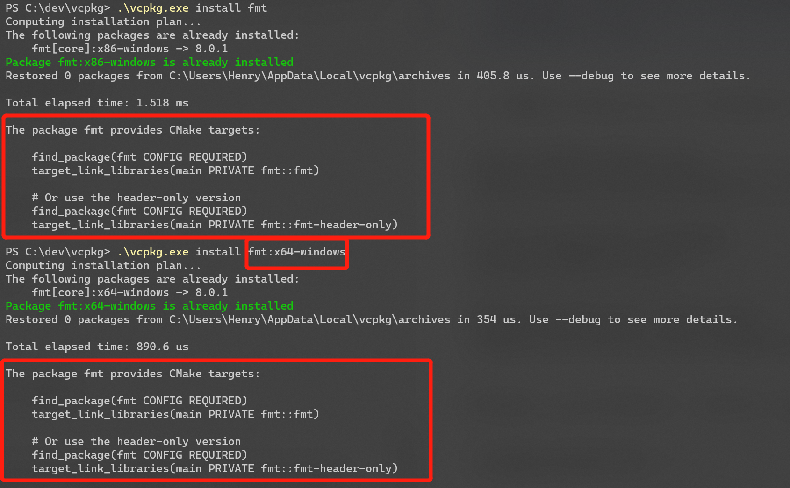
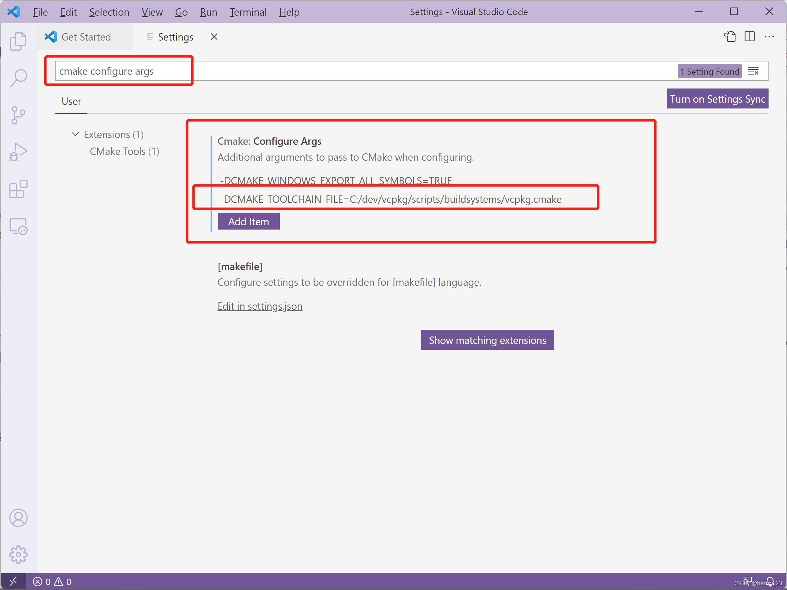
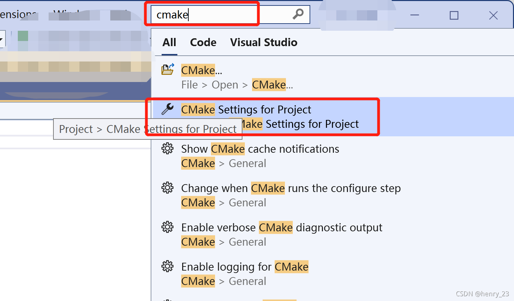
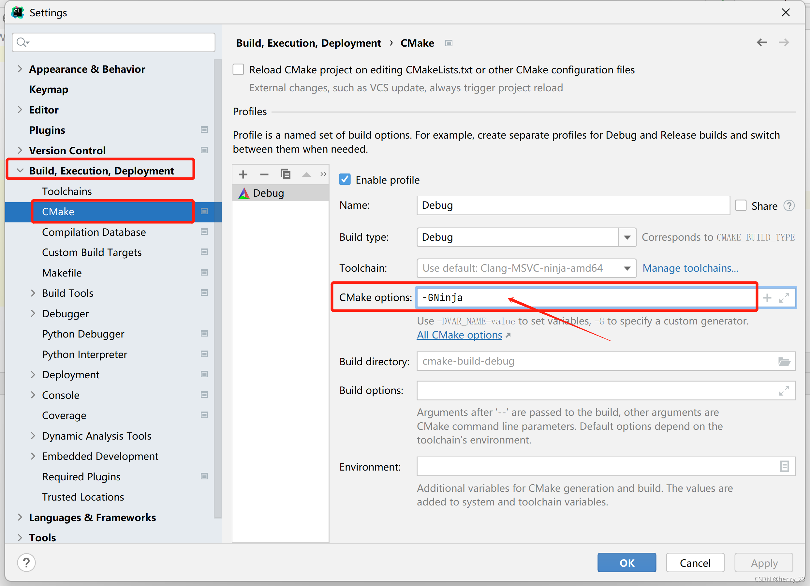

# Windows 下使用 vcpkg + CMake 进行开发

## vcpkg

vcpkg 是一款开源的、基于源代码的 C++ 依赖管理器。简单地说，用户可以使用 vcpkg 安装自己需要的 C++ 依赖。

将 vcpkg 的整个仓库克隆在本地，再执行提供的脚本，即可完成 vcpkg 的部署，详情参见 [vcpkg 仓库的 README](https://github.com/microsoft/vcpkg) 或 [网站上的说明材料](https://vcpkg.io/en/getting-started.html)。

> 无论是 vcpkg 还是之后安装软件包的代码，很多都是从 GitHub 取得的，因此可能需要用户具有相应的网络访问环境。
> 
> *一般，每月只需要两瓶矿泉水钱，就能买到可以用的代理。*
> 
> 笔者实验时，vcpkg 会**自动使用系统代理**（如果进行了相应的配置），但执行 `git clone` 可能需要在终端中**手动设置 HTTP 和 HTTPS 代理服务器地址相关的环境变量**。

vcpkg 的若干实例是互不影响的。可以在计算机上部署多个 vcpkg 的实例。

> 针对其这个特性，用户可以切换到 vcpkg 的目录下再执行命令，而不是将 vcpkg 可执行文件的路径添加到 PATH。

由于 vcpkg 是基于源代码的，因此在安装软件包之前，需要用户先安装微软的编译器 MSVC。除此之外，还需要额外安装 Visual Studio 的英语（English）语言包，才能顺利执行安装操作。

> 也可以使用 MSYS2 作为开发环境使用 vcpkg，但是笔者暂未实验，故不作展开。

## 以安装 OpenCV 为例

以安装 OpenCV 为例，用户在终端中切换到 vcpkg 的安装目录后，执行下面命令即可安装 OpenCV：

```console
PS> ./vcpkg install opencv
```

需要注意，对于 OpenCV 以及其他一些包，vcpkg 在安装时**有不同的 feature 可供选择**。可以在 [vcpkg 网站上检索包对应的信息](https://vcpkg.io/en/packages.html)，或者使用 `./vcpkg search <packagename>` 进行检索。

比如，我们可以执行下面的命令，选择需要的 feature 并进行安装：

```console
PS> ./vcpkg install opencv[core,dnn,jpeg,png,quirc,tiff,webp]
```

之后便会开始相对比较漫长的代码编译过程，可能会耗费约数十分钟或更久。同样，建议将 vcpkg 的目录添加进**反病毒软件的排除项**，可以加快速度。

除此之外，在 Windows 上，上述命令默认将会构建针对 x86-windows 平台的 OpenCV，我们还需要手动指定构建安装针对 x64-windows 平台的 OpenCV。

```console
./vcpkg install opencv:x64-windows
```

编译过程中会产生很多文件（如 vcpkg 目录下的 buildtrees 目录，存放构建过程中产生的文件，如果保留可能会减少下次更新时花费的时间），可能会占用十数 GB 的磁盘空间。可以根据需要删除这些中间文件。

## 使用 vcpkg 中安装的包

在如上述文章安装好 OpenCV 后，只需要在 `CMakeLists.txt` 中使用 `find_package(OpenCV REQUIRED)` 即可引入需要的安装包。

在使用时可能还需要为 CMake 传入正确的参数，也就是 **vcpkg 工具链的路径**，具体操作将会在下文介绍。

### CMakeLists.txt 示例

一个完整的 CMakeLists.txt 文件类似如下：

```cmake
project(CMAKE_OPENCV_TEST)
cmake_minimum_required(VERSION 3.13)

find_package(OpenCV REQUIRED)
# message("${OpenCV_DIR}")

add_executable(main "hello.cpp")
target_link_libraries(main ${OpenCV_LIBS})
```

有些通过 vcpkg 安装的包，支持作为 CMake 目标引入，比如 {fmt} 库。

```
# 安装 fmt 库
PS> ./vcpkg install fmt
PS> ./vcpkg install fmt:x64-windows
```

这样的库安装好后，vcpkg 会有相应的提示：


  
控制台最后输出如下：

```
The package fmt provides CMake targets:

    find_package(fmt CONFIG REQUIRED)
    target_link_libraries(main PRIVATE fmt::fmt)

    # Or use the header-only version
    find_package(fmt CONFIG REQUIRED)
    target_link_libraries(main PRIVATE fmt::fmt-header-only)
```

也就是说，在 CMakeLists.txt 中可以这样子使用这样的库：

```
project(CMAKE_VCPKG_FMT_TEST)
cmake_minimum_required(VERSION 3.13)

find_package(fmt CONFIG REQUIRED)

add_executable(main "hello.cpp")
target_link_libraries(main fmt::fmt)
# 或者使用“仅头文件（header-only）”版本的 fmt
# target_link_libraries(main fmt::fmt-header-only)
```

### CMake 传参

在 CMake 配置过程中，需要将 vcpkg 目录下的 `scripts/buildsystems/vcpkg.cmake` 文件路径，作为 `CMAKE_TOOLCHAIN_FILE` 变量传入，这样 CMake 就可以识别到该 vcpkg 实例中安装的包了。

比如，假设 vcpkg 的目录位于 `C:/dev/vcpkg/`，则需要在 CMake 的“Configure Args”中添加：

```
-DCMAKE_TOOLCHAIN_FILE=C:/dev/vcpkg/scripts/buildsystems/vcpkg.cmake
```

这个选项通常可以在 IDE 的构建选项中找到。如果使用命令行界面，则可以采用类似如下的命令：

```
cmake \
    -B [build directory] \
    -S . \
    -DCMAKE_TOOLCHAIN_FILE="[path to vcpkg]/scripts/buildsystems/vcpkg.cmake"
```

> 需要注意，如果路径中包含空格，在 Shell 需要使用引号将路径包裹起来，以便Shell 将其视作一个整体传递给 CMake 程序。但如果在 IDE 中，则需要根据具体情况判断是否需要使用引号将路径包裹起来（即，IDE 在传递参数时，是直接将字符串传入给可执行程序，还是将其拼接在命令的最后并通过 Shell 界面执行命令）。
> 
> 如果有其他需要转义的字符，也需要根据 IDE 配置参数的方式，决定是否需要转义。比如，如果 IDE 使用配置文件的形式进行配置，则可能需要按照字符串字面量的转义方式对特殊符号进行处理；假如是在图形界面中输入的，则一般不需要对特殊符号进行转义。

### Visual Studio Code

VS Code 中的配置实际上是修改 CMake Tools 插件的配置，关于插件的使用见上一篇博文。

  
这个选项也可以设置成目录的（而非全局的），也就是在工作目录下新建一个 `.vscode` 目录，在其中新建一个 `settings.json`，并在其中添加一个键名为 `cmake.configureArgs` 、值为一个列表的键值对。

列表中添加一个定义 `CMAKE_TOOLCHAIN_FILE` 变量的选项：

```json
"cmake.configureArgs": [
  "-DCMAKE_WINDOWS_EXPORT_ALL_SYMBOLS=TRUE",
  "-DCMAKE_TOOLCHAIN_FILE=C:/dev/vcpkg/scripts/buildsystems/vcpkg.cmake"
]
```

`settings.json` 文件类似如下：

```json
{
  "cmake.configureArgs": [
    "-DCMAKE_WINDOWS_EXPORT_ALL_SYMBOLS=TRUE",
    "-DCMAKE_TOOLCHAIN_FILE=C:/dev/vcpkg/scripts/buildsystems/vcpkg.cmake"
  ]
}
```

其他的 IDE 配置类似。

#### Visual Studio

在 Visual Studio 的搜索中 查找 CMake Settings for Project  
  
这会在 CMake 项目下生成一个 `CMakeSettings.json` 文件，我们可以在某个配置（比如 x64-Debug）下的 `cmakeCommandArgs` 里添加相应的参数：

```json
{
  "configurations": [
    {
      "name": "x64-Debug",
      "generator": "Ninja",
      "configurationType": "Debug",
      "inheritEnvironments": [ "msvc_x64_x64" ],
      "buildRoot": "${projectDir}\\out\\build\\${name}",
      "installRoot": "${projectDir}\\out\\install\\${name}",
      "cmakeCommandArgs": "", // 在这里添加相应的参数
      "buildCommandArgs": "",
      "ctestCommandArgs": ""
    }
  ]
}
```

#### CLion

CLion 的配置也是类似，在“文件（Files）”->“设置（Settings）”->“构建、执行、部署（Build, Execution, Deplyment）”->“CMake” 中，在某个配置中的 CMake options 中添加相应的 `-D` 参数。  

