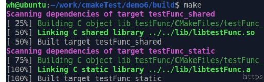

# cmake：add_library生成静态库和动态库

有时我们只需要编译出动态库，静态库，然后等着让其它程序去使用。让我们看下这种情况该如何使用cmake

# 实验

## 实验一：生成静态库

> 编写代码

项目结构如下：


- [CMakeLists.txt] - 包含你希望运行的 CMake 命令

```shell
cmake_minimum_required(VERSION 3.5)

project(hello_library)

############################################################
# Create a library
############################################################

#Generate the static library from the library sources
add_library(hello_library STATIC
        src/hello.cpp
        )

target_include_directories(hello_library
        PUBLIC
        ${PROJECT_SOURCE_DIR}/include
        )


############################################################
# Create an executable
############################################################

# Add an executable with the above sources
add_executable(hello_binary
        src/main.cpp
        )

# link the new hello_library target with the hello_binary target
target_link_libraries(hello_binary
        PRIVATE
        hello_library
        )

12345678910111213141516171819202122232425262728293031323334
```

- [include/static/hello.h] - 要包含的头文件

```cpp
#ifndef __HELLO_H__
#define __HELLO_H__

class Hello
{
public:
    void print();
};

#endif
12345678910
```

- [src/hello.cpp] - 要编译的源文件

```cpp
#include <iostream>

#include "static/hello.h"

void Hello::print()
{
    std::cout << "Hello Static Library!" << std::endl;
}

12345678910
```

- [src/main.cpp] - 具有main的源文件

```cpp
#include "static/hello.h"

int main(int argc, char *argv[])
{
    Hello hi;
    hi.print();
    return 0;
}


123456789101112131415
```

> 一些理论

（1）**添加共享库**

- `add_library()`指定从某些源文件创建库。调用方式如下：

```cpp
add_library(hello_library STATIC
        src/hello.cpp
        )
123
```

- 此命令将使用add_library()调用中的源代码创建一个名为libhello_library.a的静态库

  - ```
    add_library
    ```

    :

     

    生成动态库或静态库

    - 第1个参数指定库的名字；
    - 第2个参数决定是动态还是静态，如果没有就默认静态；
    - 第3个参数指定生成库的源文件

- 如[上一节](https://blog.csdn.net/zhizhengguan/article/details/111713320)所述，我们按照现代 CMake 的建议，将源文件直接传递给add_library调用。

- `set_target_properties`: 设置输出的名称，还有其它功能，如设置库的版本号等等

（2）**添加头文件目录**

- 在本例中，我们使用`target_include_directory()`函数将`include`目录包含在库中，并将范围设置为PUBLIC。

```cpp
target_include_directories(hello_library
    PUBLIC
        ${PROJECT_SOURCE_DIR}/include
)

12345
```

- 这将导致包含的目录在以下位置使用：
  - 在编译该库时
  - 在编译链接至该库的任何其他目标时。
- 作用域的含义是：
  - PRIVATE - 将目录添加到此目标的include目录中
  - INTERFACE - 将该目录添加到任何链接到此库的目标的include目录中（不包括自己）。
  - PUBLIC - 它包含在此库中，也包含在链接此库的任何目标中。
- 提示：
  - 对于公共头文件，让你的include文件夹使用子目录“命名空间”通常是个好主意。传递给target_include_directories的目录将是你的Include目录树的根目录，并且你的C++文件应该包含从那里到你要使用的头文件的路径。
  - 在本例中，你可以看到我们按如下方式执行操作。使用此方法意味着，在项目中使用多个库时，头文件名冲突的可能性较小。比如：

```cpp
#include "static/hello.h"
1
```

（3）**链接库**

- 在创建使用库的可执行文件时，你必须告诉编译器有关库的信息。这可以使用`target_link_library()`函数来完成。

```cpp
add_executable(hello_binary
    src/main.cpp
)

target_link_libraries(hello_binary
    PRIVATE
        hello_library
)

123456789
```

- 这告诉CMake在链接时将hello_library与hello_binary可执行文件链接起来。它还将从hello_library传递任何具有PUBLIC或INTERFACE作用范围的include目录到hello_binary。
- 编译器调用它的一个示例是:

```shell
/usr/bin/c++ CMakeFiles/hello_binary.dir/src/main.cpp.o -o hello_binary -rdynamic libhello_library.a
1
```

> 构建

```shell
[oceanstar@localhost demo]$ mkdir  build

[oceanstar@localhost demo]$ cd build/

[oceanstar@localhost build]$ cmake  ..
-- The C compiler identification is GNU 4.8.5
-- The CXX compiler identification is GNU 4.8.5
-- Check for working C compiler: /usr/bin/cc
-- Check for working C compiler: /usr/bin/cc - works
-- Detecting C compiler ABI info
-- Detecting C compiler ABI info - done
-- Detecting C compile features
-- Detecting C compile features - done
-- Check for working CXX compiler: /usr/bin/c++
-- Check for working CXX compiler: /usr/bin/c++ - works
-- Detecting CXX compiler ABI info
-- Detecting CXX compiler ABI info - done
-- Detecting CXX compile features
-- Detecting CXX compile features - done
-- Configuring done
-- Generating done


$ make
Scanning dependencies of target hello_library
[ 25%] Building CXX object CMakeFiles/hello_library.dir/src/hello.cpp.o
[ 50%] Linking CXX static library libhello_library.a
[ 50%] Built target hello_library
Scanning dependencies of target hello_binary
[ 75%] Building CXX object CMakeFiles/hello_binary.dir/src/main.cpp.o
[100%] Linking CXX executable hello_binary
[100%] Built target hello_binary
1234567891011121314151617181920212223242526272829303132
```


## 实验二：生成动态库

> 编写代码

项目结构如下：


- [CMakeLists.txt] - 包含你希望运行的 CMake 命令

```shell
cmake_minimum_required(VERSION 3.5)

project(hello_library)

############################################################
# Create a library
############################################################

#Generate the shared library from the library sources
add_library(hello_library SHARED 
    src/Hello.cpp
)
add_library(hello::library ALIAS hello_library)

target_include_directories(hello_library
    PUBLIC 
        ${PROJECT_SOURCE_DIR}/include
)

############################################################
# Create an executable
############################################################

# Add an executable with the above sources
add_executable(hello_binary
    src/main.cpp
)

# link the new hello_library target with the hello_binary target
target_link_libraries(hello_binary
    PRIVATE 
        hello::library
)


123456789101112131415161718192021222324252627282930313233343536
```

- [include/shared/hello.h] - 要包含的头文件

```cpp
#ifndef __HELLO_H__
#define __HELLO_H__

class Hello
{
public:
    void print();
};

#endif
12345678910
```

- [src/hello.cpp] - 要编译的源文件

```cpp
#include <iostream>

#include "shared/hello.h"

void Hello::print()
{
    std::cout << "Hello Static Library!" << std::endl;
}


123456789101112
```

- [src/main.cpp] - 具有main的源文件

```cpp
#include "shared/hello.h"

int main(int argc, char *argv[])
{
    Hello hi;
    hi.print();
    return 0;
}


1234567891011
```

> 一些理论

（1）**添加共享库**

- `add_library()`指定从某些源文件创建共享库。调用方式如下：

```cpp
add_library(hello_library SHARED
    src/Hello.cpp
)

1234
```

- 这将使用传递给add_library()函数的源码文件创建一个名为libhello_library.so的共享库。

（2）**别名目标**

顾名思义，别名目标是目标的替代名称，可以在只读上下文中替代真实的目标名称。

```shell
add_library(hello::library ALIAS hello_library)
1
```

- ALIAS类似于“同义词”。ALIAS目标只是原始目标的另一个名称。因此ALIAS目标的要求是不可修改的——您无法调整其属性、安装它等。
- 如下所示，这允许你在将目标链接到其他目标时使用别名引用该目标。（`hello::library`等效于`hello_library`）

（3）**链接共享库**

- 链接共享库与链接静态库相同。创建可执行文件时，请使用target_link_library()函数指向库。

```cpp
add_executable(hello_binary
    src/main.cpp
)

target_link_libraries(hello_binary
    PRIVATE
        hello::library
)

123456789
```

- 这告诉CMake使用别名目标名称将hello_library链接到hello_binary可执行文件。
- 链接器调用它的一个示例是：

```shell
/usr/bin/c++ CMakeFiles/hello_binary.dir/src/main.cpp.o -o hello_binary -rdynamic libhello_library.so -Wl,-rpath,/home/matrim/workspace/cmake-examples/01-basic/D-shared-library/build
1
```

> 构建

```shell
$ mkdir build

$ cd build

$ cmake ..
-- The C compiler identification is GNU 4.8.4
-- The CXX compiler identification is GNU 4.8.4
-- Check for working C compiler: /usr/bin/cc
-- Check for working C compiler: /usr/bin/cc -- works
-- Detecting C compiler ABI info
-- Detecting C compiler ABI info - done
-- Check for working CXX compiler: /usr/bin/c++
-- Check for working CXX compiler: /usr/bin/c++ -- works
-- Detecting CXX compiler ABI info
-- Detecting CXX compiler ABI info - done
-- Configuring done
-- Generating done
-- Build files have been written to: /home/matrim/workspace/cmake-examples/01-basic/D-shared-library/build

$ make
Scanning dependencies of target hello_library
[ 50%] Building CXX object CMakeFiles/hello_library.dir/src/Hello.cpp.o
Linking CXX shared library libhello_library.so
[ 50%] Built target hello_library
Scanning dependencies of target hello_binary
[100%] Building CXX object CMakeFiles/hello_binary.dir/src/main.cpp.o
Linking CXX executable hello_binary
[100%] Built target hello_binary

$ ls
CMakeCache.txt  CMakeFiles  cmake_install.cmake  hello_binary  libhello_library.so  Makefile

$ ./hello_binary
Hello Shared Library!
12345678910111213141516171819202122232425262728293031323334
```

## 实验三：仅生成库但是不使用库

> 编写代码

项目结构如下：


```cpp
/*
** testFunc.c
*/

#include <stdio.h>
#include "testFunc.h"

void func(int data)
{
	printf("data is %d\n", data);
}
1234567891011
/*
** testFunc.h
*/

#ifndef _TEST_FUNC_H_
#define _TEST_FUNC_H_

void func(int data);

#endif


123456789101112
```

最外层的CMakeLists.txt内容如下：

```c
cmake_minimum_required (VERSION 2.8)

project (demo)

#向当前工程添加存放源文件的子目录
add_subdirectory (lib_testFunc)
123456
```

lib_testFunc目录下的CMakeLists.txt如下：

```cpp
aux_source_directory (. SRC_LIST)

# 使用${SRC_LIST}为原材料生成一个叫做testFunc_shared 的动态库
add_library (testFunc_shared SHARED ${SRC_LIST})
# 使用${SRC_LIST}为原材料生成一个叫做testFunc_static 的静态库
add_library (testFunc_static STATIC ${SRC_LIST})

# 将testFunc_shared 重新命名为 libtestFunc.so
set_target_properties (testFunc_shared PROPERTIES OUTPUT_NAME "testFunc")
# 将testFunc_static  重新命名为 libtestFunc.a
set_target_properties (testFunc_static PROPERTIES OUTPUT_NAME "testFunc")

# 设置 库文件的默认输出路径
set (LIBRARY_OUTPUT_PATH ${PROJECT_SOURCE_DIR}/lib)

123456789101112131415
```

命令：

- `set_target_properties`: 设置输出的名称，还有其它功能，如设置库的版本号等等

预定义变量：

- `LIBRARY_OUTPUT_PATH`: 库文件的默认输出路径，这里设置为工程目录下的lib目录

> 编译

现在，让我们进入build目录下运行cmake …，成功后再运行make：



cd到lib目录下进行查看，发现已经成功生成了动态库和静态库，


ps：可以看出前面使用set_target_properties重新定义了库的输出名字，如果不用set_target_properties也可以，那么库的名字就是add_library里定义的名字，只是我们连续2次使用add_library指定库名字时，这个名字不能相同，而set_target_properties可以把名字设置为相同，只是最终生成的库文件后缀不同，这样相对来说会好看点。

# add_library

## 普通库

```shell
add_library(<name> [STATIC | SHARED | MODULE]
            [EXCLUDE_FROM_ALL]
            [source1] [source2] [...])
123
```

- ```
  <name>
  ```

  - 表示库文件的名字，该库文件会根据命令里列出的源文件来创建。
  - < name>对应于逻辑目标名称，并且在项目中必须是全局唯一的。
  - 构建的库的实际文件名是基于本机平台的约定（如lib< name>.a或< name>.lib）构建的。

- ```
  [STATIC | SHARED | MODULE]
  ```

   

  指定要创建的库的类型

  - SHARED：
    - 动态库。动态库是动态链接并在运行时加载的
    - 如果库不导出任何符号，则不能将其声明为SHARED库
  - STATIC：静态库。静态库是在链接其他目标时使用的目标文件存档
  - MODULE：
    - 模块库是没有链接到其他目标的插件，但可以在运行时使用类似dlopen的功能动态加载
    - 在使用 dyld 的系统有效,如果不支持 dyld,则被当作 SHARED 对待。

- `EXCLUDE_FROM_ALL`：这个库不会被默认构建，除非有其他的组件依赖或者手工构建。

- `[source1] [source2] [...]`：指定生成库的源文件

## 对象库

```cpp
add_library(<name> OBJECT [<source>...])
1
```

创建一个对象库。对象库编译源文件，但不归档或者将它们的目标文件链接到库中。相反，add_library()或者add_executable()创建的其他目标可以使用$< TARGET_OBJECT:objlib>形式的表达式作为源引用对象
，其中objlib是对象库名称。例如：

```cpp
add_library(... $<TARGET_OBJECTS:objlib> ...)
add_executable(... $<TARGET_OBJECTS:objlib> ...)
12
```

将包括objlib的目标文件在一个库和一个可执行文件，连同那些从自己的源编译。对象库可能只包含编译源、头文件和其他不会影响普通库链接的文件(例如.txt)。它们可能包含生成此类源的自定义命令，但不包含PRE_BUILD、PRE_LINK或POST_BUILD命令。一些原生构建系统(如Xcode)可能不喜欢只有对象文件的目标，所以考虑添加至少一个真正的源文件到任何引用$的目标。

3.12新版功能:可以用target_link_libraries()链接到对象库。

# 总结

命令总结：

| 命令                  | 说明               | 示例                                                         |
| --------------------- | ------------------ | ------------------------------------------------------------ |
| `add_library`         | 生成动态库或静态库 | `add_library (testFunc_shared SHARED ${SRC_LIST})`           |
| set_target_properties | 设置输出的名称     | `set_target_properties (testFunc_shared PROPERTIES OUTPUT_NAME "testFunc")` |

预定义变量总结：

| 预定义变量            | 说明                 |
| --------------------- | -------------------- |
| `LIBRARY_OUTPUT_PATH` | 库文件的默认输出路径 |